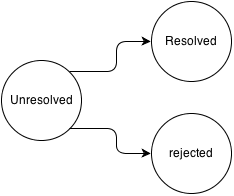

## Speakers

* Grégoire Charvet (geekingfrog.com)
  * Full time node.js developper
  * Passionate about the web
  * Working on the web for almost 2 years now


## Practical Promises


## AKA

* Future (c++, scala, java)
* Defer (twisted)


## Native in node!

<div class="fragment">
V0.2.0...
Removed in 0.3
</div>


## Back to the topic
### What is a Promise?

Wikipedia!

> They describe an object that acts as a proxy for a result that is initially unknown, usually because the computation of its value is yet incomplete.


# Three states


 * Start in the `unresolved` (or `pending`) state.
 * Cannot change state more than once.


# In practice
```javascript
var promise = new Promise(function(
  resolve,
  reject
) {
  // do something
});
```


```javascript
var promise = new Promise(function(
  resolve,
  reject
) {
  if(Math.random() > .5) resolve();
  else reject();
}
```


# The key method: `.then`

```javascript
function worldDomination() {
  hireHenchen(); // returns a promise
  .then(trainHenchmen) // returns another promise
  .then(makeHenchemWork)
  .then(profit);
}
```


```javascript
function giveMeFive() {
  var two = Promise.resolve(2);
  var four = two.then(function(two) {
    return two + two;
  })
  return four.then(function(four) {
    return 1 + four;
  });
}
```


# Error handling


## With callback

```javascript
doSomethingAsync(function(err, val) {
  if(err) return console.error(err);
  user.setVal(val);
});
```


```javascript
-> % node boom.js 
/home/greg/meetup/promises/boom.js:8
  user.setVal(val);
  ^
ReferenceError: user is not defined
    at /home/greg/meetup/promises/boom.js:8:3
    at null._onTimeout (/home/greg/meetup/promises/boom.js:3:5)
    at Timer.listOnTimeout (timers.js:133:15)
greg@archGreg [08:55:56] [~/meetup/promises]
-> % CRASH !
```


### Pokemon error handling
```
asyncStuff(function(err, val) {
  try {
    //...
  } catch(error) {
    // more ...
  }
})
```


### With decorators
```
function catchThemAll(fn) {
  return function() {
    try {
      return fn.apply(this, arguments);
    } catch(err) { /* handle */ }
  }
}
asyncStuff(catchThemAll(callback));
```


### In node.js
```
process.on('uncaughtException', function(err) {
  // handle
});
```


### With Promises

* Throwing error put the promise in rejected state
* Skip all further `then` handler
* Until a `catch`
* Throw in the global scope if `.done` is called


```javascript
Promise.resolve()
.then(function() { throw new Error('boom'); })
.then(function() { /* not executed */ })
.then(function() { /* not executed */ })
.catch(function(error) {
  return 'there there'
})
.then(function(stuff) { stuff === 'there there'; });
```


### Advantage: handle error in one place
And maybe even later if you don't feel it now

```
function randomService(id) {
  return db.findById(id)
  .then(checkObjectIsValid)
  .then(getAnotherObject)
  .then(checkRelations);
}
```
No more
```
if(error) return callback(error);
```
**everywhere**


# Watch out


### Non-terminated chain
```javascript
Promise.resolve()
.then(function() { throw new Error('boom'); });
```
<div class="fragment">...</div>
<div class="fragment">...</div>
<div class="fragment">...</div>
<div class="fragment">...</div>
<div class="fragment">nothing???</div>


### Don't forget the `done`
```javascript
Promise.resolve()
.then(function() { throw new Error('boom'); })
.done();
```
<pre class="fragment" style="font-size:.8em">
/home/greg/meetup/promises/node_modules/bluebird/js/main/async.js:93
throw res.e;
         ^
Error: boom
    at /home/greg/meetup/promises/boom.js:4:26
    at tryCatch1 (/home/greg/meetup/promises/node_modules/bluebird/js/main/util.js:43:21)
    at Promise$_callHandler [as _callHandler] (/home/greg/meetup/promises/node_modules/bluebird/js/main/promise.js:627:13)
[...]
</pre>
</div>


### Another trap

<!-- .slide: class="side-by-side-code" -->
<pre><code class="javascript left">//Don't do that
asyncStuff()
.then(function ok(data) {
  // process data
}, function oops(error) {
  // handle error
});
</code></pre>
<pre><code class="javascript right">//This is better
asyncStuff()
.then(function ok(data) {
  // process data
})
.catch(function oops(error) {
  // handle error
});
</code></pre>


# That's all
<h3 class="fragment">for how promise works</h3>


# How to work with promises?


## Implementation

* [Use bluebird](https://github.com/petkaantonov/bluebird/)
  + great api
  + fantastic performances

* Other libs
  + [Q](https://github.com/kriskowal/q)
  + [when](https://github.com/cujojs/when)
  + [kew](https://github.com/Medium/kew)


### Real life example

Using facebook API to post something on user's wall
```
FB.login(function(){
  FB.api(
    '/me/feed',
    'post',
    {message: 'Hello, world!'}
  );
}, {scope: 'publish_actions'});
```


### Promisified login

```
FB.login({scope: 'publish_actions'})
.then(function() {
  FB.api(/* ... */);
})
```


### Passing promises around

```
var fbLogin = FB.login({scope: 'publish_actions'});

function postStuff(msg) {
  return fbLogin.then(function() {
    // post stuff on the user's wall
  })
}
```


### Promises in the wild

* `jQuery.ajax`, `jQuery.get` return promises

```javascript
$.get('/api/profile/me').then(function(profile) {
  // do stuff
})
```


```json
$.get('/api/user/abc')
{
  "id": "abc",
  "posts": ["123", "456", "789"]
}
```
Goal: get all the posts for the given user:

```
function getUserPosts(userId)
```


<h3>Callback solution</h3>
<div style="font-size:.5em">
<pre>
<code class="javascript">
function getUserPosts(userId, callback) {
  function getPost(postId, callback) {
    $.get('/api/post/'+postId, callback);
  }

  $.get('/api/user/'+userId, function(data) {
    var asyncOperations = data.posts.map(function(postId) {
      return function(cb) { getUserPosts(postId, cb); }
    })
  })

  async.parallel(asyncOperations, function(error, posts) {
    if(error) //handle
    else callback(posts);
  })
}
</code>
</pre>
</div>


### With promises
```
function getUserPosts(userId) {
  return Promise.cast($.get('/api/user/'+userId))
  .then(function(user) {
    return user.posts;
  })
  .map(function(postId) {
    // you can return a promise here too!
    return $.get('/api/post/'+postId);
  }).all();
}
```


### Preserving order with `each`

```
Promise.resolve([uri1, uri2, uri3])
.each(function(uri) {
  return $.get(uri);
}).all();
```


### Timeouts
<pre>
<code class=javascript style="overflow:visible">
function getWithTimeout(uri, time) {
  var jqXhr = $.get(uri);
  return Promise.resolve(jqXhr)
  .timeout(time)
  .catch(TimeoutError, CancellationError, function(e) {
    jqXhr.abort();
    throw e; // don't swallow the error
  })
  .catch(function(err) { // pokemon
    console.error('Got error:', err);
  });
}
</code>
</pre>


### With an event emitter

<pre>
<code class="javascript" style="overflow:visible">
var mongoose = require('mongoose');
mongoose.connect('mongodb://localhost/test');

// pending connection to the db
var db = mongoose.connection;
db.on('error', console.error.bind(console, 'connection error:'));
db.once('open', function callback () {
  // yay!
});
</code>
</pre>

<div class="fragment">
Soooooo. All my code is inside the callback?
</div>


### Promisify this

```
function connect() {
  var resolver = Promise.defer();
  var db = mongoose.connection;
  db.once('error', resolver.reject);
  db.once('open', resolver.resolve);
  return resolver.promise;
}
```


```
var db = connect();
function findAllUsers() {
  return db.then(function() {
    return User.findAll().exec();
  })
}
```
* No concurrency issue: is my data there yet?


## Debugging


<pre>
<code class="javascript" style="overflow:visible;font-size:.8em">
Promise.resolve().then(function outer() {
    return Promise.resolve().then(function inner() {
        return Promise.resolve().then(function evenMoreInner() {
            a.b.c.d()
        }).catch(function catcher(e) {
            console.error(e.stack);
        });
    });
});
</code>
</pre>

<pre>
<code style="font-size:.6em;margin-top:-2em;line-height:1em;overflow:visible">
ReferenceError: a is not defined
    at evenMoreInner ([anonymous]:6:13)
    at tryCatch1 ([anonymous]:41:19)
    at Promise$_resolvePromise [as _resolvePromise] ([anonymous]:1739:13)
    at Promise$_resolveLast [as _resolveLast] ([anonymous]:1520:14)
    at Async$_consumeFunctionBuffer [as _consumeFunctionBuffer] ([anonymous]:560:33)
    at Async$consumeFunctionBuffer ([anonymous]:515:14)
    at MutationObserver.Promise$_Deferred ([anonymous]:433:17)
</code>
</pre>


### Long stack traces
<pre>
<code class="javascript" style="font-size:.7em;line-height:1.1em">
ReferenceError: a is not defined
  at evenMoreInner ([anonymous]:6:13)
From previous event:
  at inner ([anonymous]:5:24)
From previous event:
  at outer ([anonymous]:4:20)
From previous event:
  at [anonymous]:3:9
  at Object.InjectedScript._evaluateOn ([anonymous]:581:39)
  at Object.InjectedScript._evaluateAndWrap ([anonymous]:540:52)
  at Object.InjectedScript.evaluate ([anonymous]:459:21)
</code>
</pre>

### Works in firefox and chrome too \o/


#### Bluebird is great to start with promises

* Automatically warn you when you forget the `done`

```
Promise.resolve().then(function() {
  throw new Error('boom');
});
```

<div class="fragment">
<pre style="font-size: .6em; line-height:.9em; overflow: visible;word-wrap: normal;">
Possibly unhandled Error: boom
    at /home/greg/meetup/promises/boom.js:4:26
    at tryCatch1 (/home/greg/meetup/promises/node_modules/bluebird/js/main/util.js:43:21)
    at Promise$_callHandler [as _callHandler] (/home/greg/meetup/promises/node_modules/bluebird/js/main/promise.js:627:13)
    at Promise$_settlePromiseFromHandler [as _settlePromiseFromHandler] (/home/greg/meetup/promises/node_modules/bluebird/js/main/promise.js:641:18)
    at Promise$_settlePromiseAt [as _settlePromiseAt] (/home/greg/meetup/promises/node_modules/bluebird/js/main/promise.js:800:14)
    at Async$_consumeFunctionBuffer [as _consumeFunctionBuffer] (/home/greg/meetup/promises/node_modules/bluebird/js/main/async.js:75:12)
    at Async$consumeFunctionBuffer (/home/greg/meetup/promises/node_modules/bluebird/js/main/async.js:38:14)
    at process._tickCallback (node.js:339:11)
    at Function.Module.runMain (module.js:492:11)
    at startup (node.js:124:16)
</pre>
</div>


# Start using promises today
### how to deal with legacy code


# Use promises when available
* `jQuery` jqXhr are promises
* `Mongoose` query return a promise when calling `exec`


### Promisifying jquery

<!-- .slide: class="side-by-side-code" -->
<pre><code class="javascript left">$.get(
  url,
  function success(data) {
    // handle success
  }, function error(err) {
    // handle error
  }
);
</code></pre>
<pre><code class="javascript right">$.get(url)
.then(function(data) {
  //process
})
.fail(function(err) {
  // handle
});
</code></pre>


### Promisifying event based api

Like indexedDB, websocket, most of the DOM api

```
var request = store.put({
"text": 'some text',
"timeStamp" : Date.now()
});

request.onsuccess = function(e) { /* do stuff */ };

request.onerror = function(e) { /* handle error */};
```


### Use the defer() to wrap it inside a promise
```javascript
store.putAsync = function(data) {
  var resolver = Promise.defer();
  var request = store.put(data);
  request.onsuccess = resolver.resolve;
  request.onerror = resolver.reject;
  return resolver.promise;
}
```


### In node land

If you're using bluebird `Promise.promisifyAll`

```
var fs = Promise.promisifyAll(require('fs'));
var file = fs.openAsync(path, 'r');
file.then(function(fd) { ... });
```

`Promise.nodeify`
```
function doAsyncStuff(callback) {
  return asyncWithPromise()
  .then(moreProcessing)
  .nodeify(callback);
}
```


# With generators


### Coroutine support
```
Promise.coroutine(function* () {
  try {
    let db = yield connect();
    let users = yield db.getUsers();
    console.log('we got %d users here', users.length);
  } catch(err) {
    console.error('error:', err);
  }
});
```
* Completely async (non blocking)
* But can program like if it were synchronous


# Conclusion


### Avantages of promises
* Easily composable/chainable
* Can be passed around with a unified interface
* Don't have to manually handle the order of async dependencies
* With generators: coroutines \o/

### Downsides
* A bit weird at first (very functional way of thinking)
* There is no problem promises can solve that callbacks cannot
* Most libraries uses callbacks
* Not suited for event based api (with multiple events)


# Q&A
